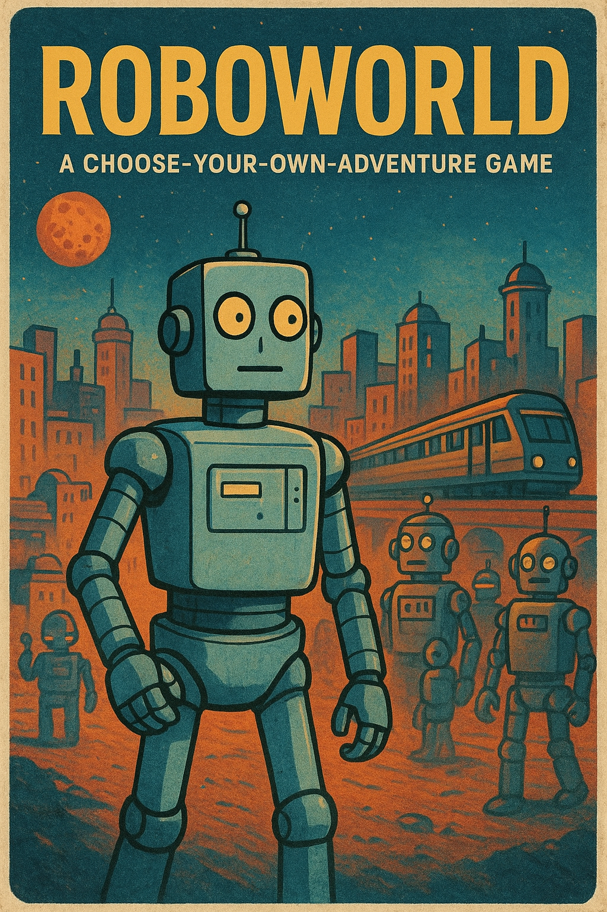

# Roboworld

## Plot

The player wakes up to find themselves on a strange alien world populated by
robots. They seem content to execute their programming, except they have
forgotten how to do many things, like how to run the trains.

Terminal-based choose-your-own-adventure prototype built in Python.

## Quick Start

Requires Python 3.10+ (standard library only).

Run directly:

```bash
python -m roboworld
```

You start in Alpha City / Central Yard. Talk to robots, learn the station
override code, and unlock the local train station.

## Structure

`roboworld/models.py` — dataclasses for World, City, Neighborhood, Region, Robot, DialogNode, DialogChoice.

`roboworld/world_data.py` — initial world scaffold (1 city, 1 neighborhood, 3 regions, 2 robots, simple puzzle).

`roboworld/game.py` — main game loop (exploration + conversation + station unlock).

`roboworld/__main__.py` — enables `python -m roboworld` execution.

## Teaching TODO Hooks

Search for `TODO:` comments to find extension ideas:

- Add more neighborhoods & cities
- Add inventory system
- Expand dialog DAGs
- Add a save/load feature
- Insert ASCII art banners
- Implement more complex puzzles

## Design Notes

- Dialog stored as DAG; each node lists choices leading to other nodes.
- Effects are simple string tokens (`gain:station_code`) collected in player state.
- Code favors clarity > performance; minimal branching complexity.
- World state structured so persistence can be added later.

## Extending

Add a new robot:

1. Create dialog nodes in `world_data.py`.
2. Instantiate `Robot` and append to a region's `robots` list.
3. Optionally add new effects for puzzles.

Add a new region:

1. Create a `Region` with connections to existing regions.
2. Add it to the neighborhood's `regions` dict.

Create another neighborhood or city: replicate pattern used for `Central Yard` inside `create_world()`.

## License

Educational prototype — feel free to modify and expand.
The player's goal is to speak with the robots and learn from them, and then fix
various problems. When the player solves the robot problems, they remember how
to run the train and the player can progress.

Please refer to [the initial prompt](prompts/prompt-1.md) for more!


